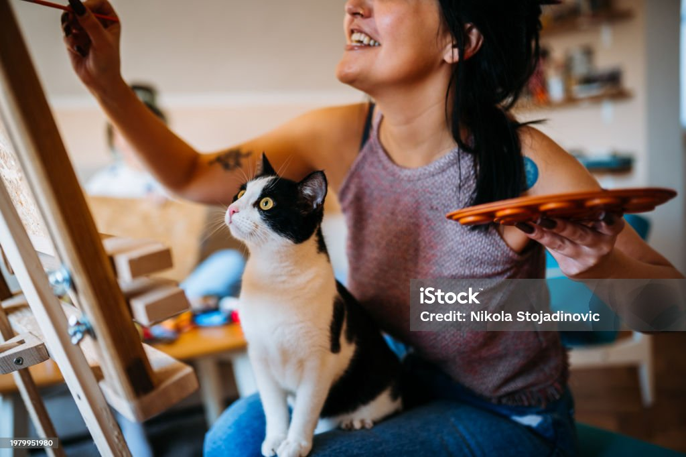

# Test for class

## Practicing Markdown

### This is heading 3

*Digital Humanities*

**Canadian Studies**

***Canadian Studies with Digital Humanities***

- A point

A [link](https://dh-coding-docs.netlify.app/workshop-i/markdown-reference/)

> To be or not to be - qoute 

